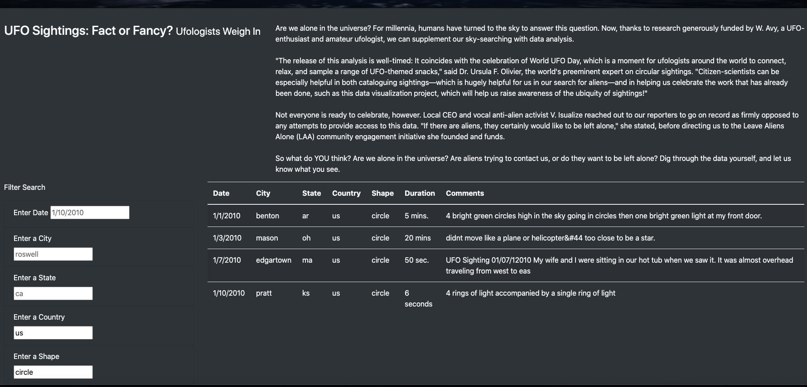
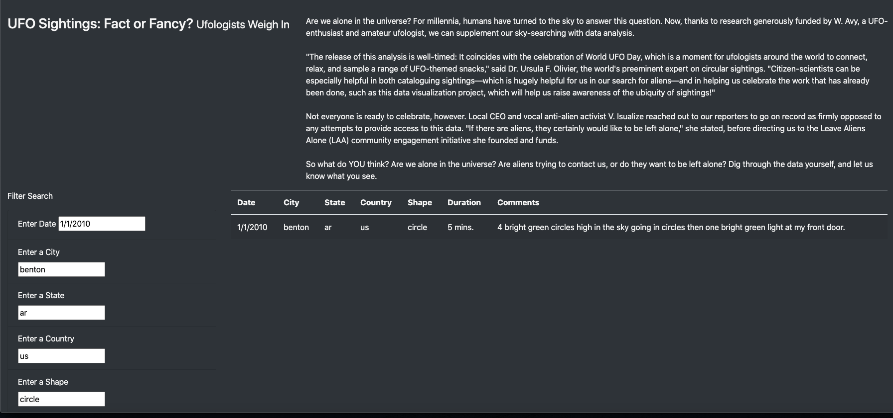

# UFOs
# Overview of the analysis

The main purpose of the analysis is to help Dana build a webpage with dynamic table to allow users an in-depth analysis of UFO sightings by allowing them to filter for multiple criteria at the same time. In addition to the date, we will be adding table filters for the city, state, country, and shape.

# Results

As can be seen in below snapshot, 

based on the search criteria users can apply multiple filters and get the data matching only those filters. In below example, filtering is applied on Country = "us" & Shape = "circle" and results will appear with data matching those two filters.

In-depth search analysis can also be done by filtering on all fields. As you can see in below example, 

filtering is applied on Date= "1/1/2010", City = "benton", State = "ar", Country = "us" & Shape = "circle". Only one row of data matches our serach criteria.

# Summary
 
## Drawback of current implementation

- There is no option to clear/remove a specific filter option(Each time a specific filter is to be cleared, it needs to be manually deleted by placing cursor in the input box and delete)
  
## Recommendations for further development

- A single "Apply filters" button can be implemented to apply search for all filters at once

- Search criteria can be made user friendly by implenting an option to clear each filter with one click(for example "x")

- A dropdown with all available filtering options can be implemented